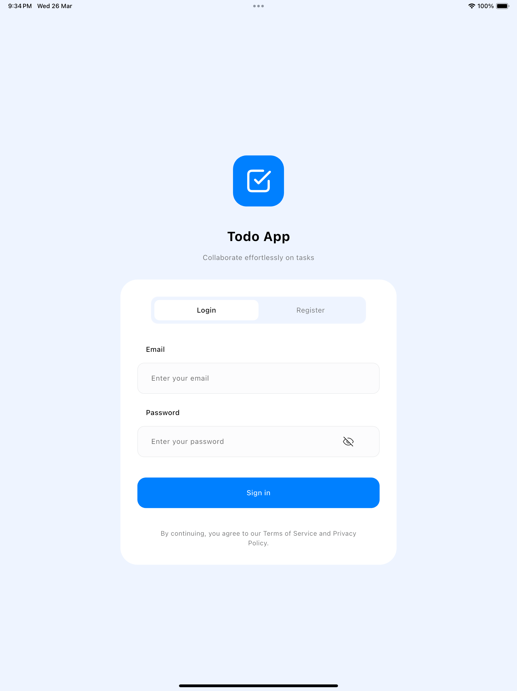

# Task Management App

## Overview
This is a Task Management Application built using Flutter, designed to demonstrate real-time collaboration and push notification features. The app utilizes Firebase services for authentication, real-time database updates, and notifications.

## Features

### 1. **User Authentication**
- Sign up and log in with Firebase Authentication.
- Secure access control for users.

### 2. **Task Management**
- Create, edit, and delete tasks.
- Tasks include:
  - Title
  - Description
  - Status (To Do, In Progress, Completed)
  - Due Date
- Real-time updates using Firebase Firestore.

### 3. **Real-Time Collaboration**
- Changes to tasks reflect instantly for all users.

### 4. **Push Notifications**
- Firebase Cloud Messaging (FCM) for task reminders.
- Local notifications for tasks.

### 5. **State Management**
- Use Cubit for efficient state handling.

### 6. **Responsive UI**
- Adaptive design for different screen sizes.

## Mobile Screenshots

## Tablet Screenshots

## Technologies Used
- **Flutter** (Dart)
- **Firebase Authentication** (User Management)
- **Firebase Firestore** (Real-time Database)
- **Firebase Cloud Messaging (FCM)** (Push Notifications)
- **Cubit** (State Management)

## Deliverables
- [Demo Video](https://www.youtube.com/watch?v=2AcwQIhcDNw)
- [APK File](https://drive.google.com/drive/folders/1f8Ms8_FbmhFpEa7FYe1LBpRfu_fct3hh?usp=share_link)

## Visitors Count
